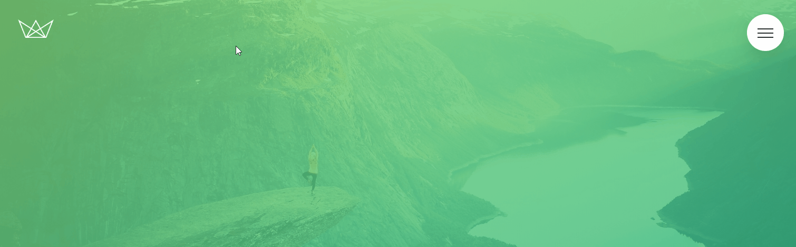

# Natours

---

 

> Este projeto foi realizado em acompanhamento ao curso ministrado dentro da plataforma Udemy, cujo seu idealizador é [Jonas Schmedtmann](https://twitter.com/jonasschmedtman). Clique na imagem para visualizar o site.

## Descrição

> O objetivo principal de aprendizagem com este projeto foi criar uma página simulada de uma agência de turismo, procurando manter a fidedignidade do acesso e aparência de uma, utilizando um design inovador contendo diversos efeitos visuais e interativos, deixando a experiência do usuário rica e muito mais agradável. Para tal, foram utilizadas as principals tecnologias front-end.

## Caracteristicas

- Layout responsivo
- Animações e transições customizadas
- Cards interativos
- Menu expansor

## Tecnologias

- HTML5
- CSS3
- Sass